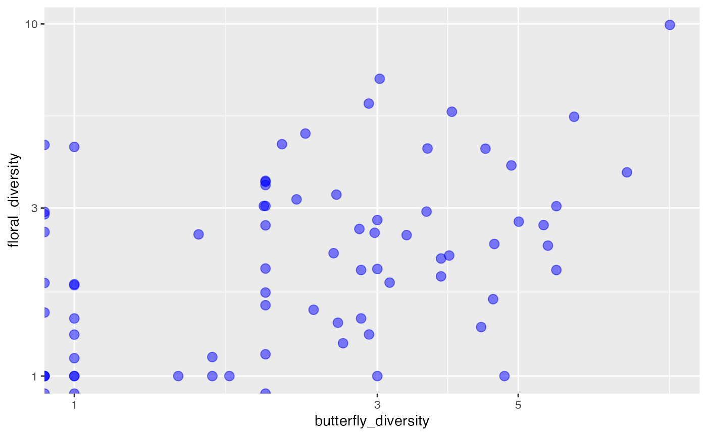

# Dataset for Butterflies

<!-- badges: start -->
<!-- badges: end -->

## Introduction

The dataset that i will be showcasing is the Multitrophic metacommunity dataset (butterflies, flowering plants, and butterfly predators). It highlights the effect of mutualistic predators and partners within the butterfly metacommunity as well as how the local environment plays a role in impacting butterfly richness and diversity. I chose this data as I wanted to learn about the external factors that contribute to the overall butterfly diversity and richness. 

Citation: Gordon, S. C. C., & Kerr, J. T. (2022). Floral diversity increases butterfly diversity in a multitrophic metacommunity. Ecology, 103(8), e3735. https://doi.org/10.1002/ecy.3735

Data: Dryad_Data.csv

## Graph

The graph highlights the correlation between butterfly diversity and floral diversity. As we can observe from the graph, it possesses positive correlation as the two variables move in the same direction.

## Myself

Hi, my name is Avi. I am a second year Human Biology major and I enjoy baking, watching movies, and spending time with my family and friends. Some of my favorite shows are 2521, Desperate Housewives, and Modern Family. A fun fact about me is that I am vegetarian and I enjoy biking around town with my friends! My dream job would be to work as a optometrist and in my undergraduate journey, I would like to complete my bachelor's degree, apply to optometry school, and work as an optometrist in the future.
